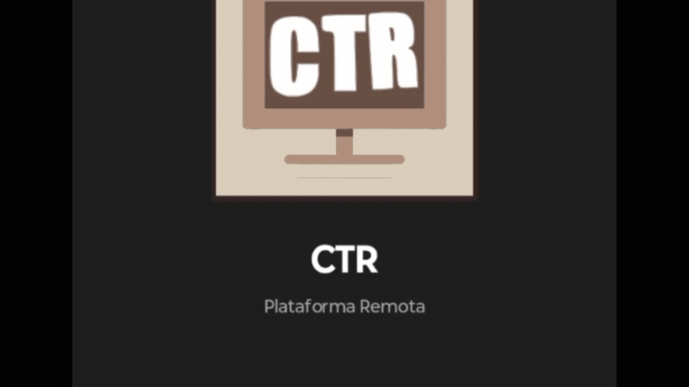
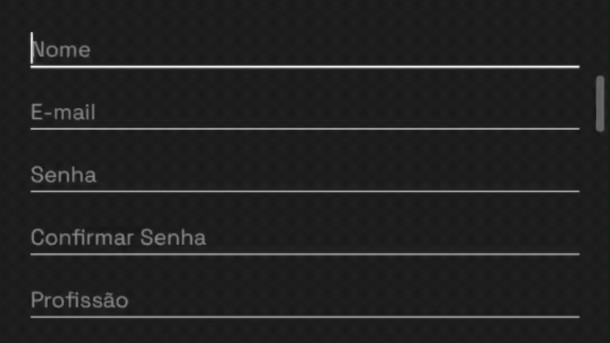
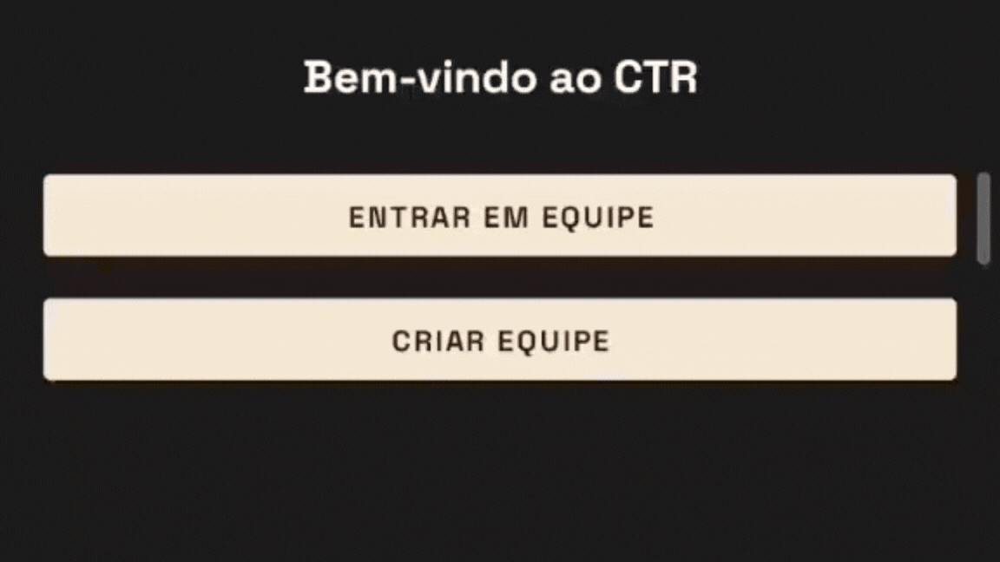
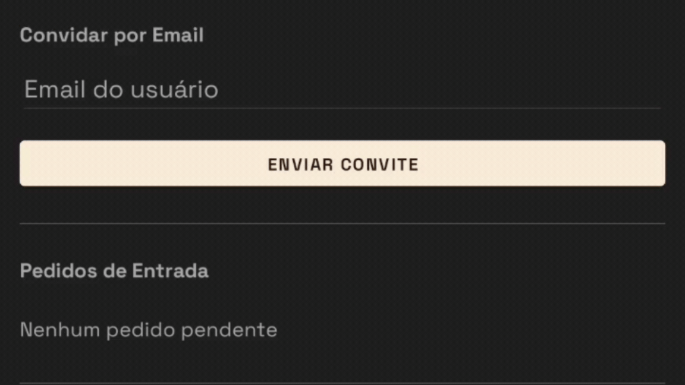

# Plataforma Colaborativa de Trabalho Remoto

<p align="center">
  Aplicativo mobile desenvolvido para auxiliar na organização,
  distribuição e acompanhamento de trabalhos realizados por
  equipes em ambientes de trabalho remoto.
</p>

---

## Sobre o Projeto

A Plataforma Colaborativa de Trabalho Remoto é um aplicativo mobile desenvolvido com o objetivo de centralizar informações relacionadas às atividades de equipes que trabalham remotamente.

A aplicação permite o gerenciamento de usuários, equipes e trabalhos, proporcionando uma forma organizada de acompanhar as atividades e facilitar a colaboração entre os integrantes.

Além disso, o app oferece **comunicação em tempo real** entre membros (chat 1-a-1, grupos e equipes), **envio de mídia** (fotos, vídeos, arquivos), **notificações** e **métricas de produtividade**.

O projeto foi desenvolvido como Trabalho de Conclusão de Curso (TCC).

---

## Funcionalidades

### Autenticação e perfil
- Cadastro de usuários (Firebase Authentication)
- Autenticação por e-mail e senha
- Gerenciamento de informações do usuário
- Avatar (upload via Cloudinary)
- Links sociais (LinkedIn, GitHub, portfólio)

### Equipes
- Criação e gerenciamento de equipes
- Gerenciamento de membros das equipes
- Envio e gerenciamento de convites
- Solicitações de entrada em equipes (com motivos e especialidades)
- Promoção a administrador / remoção de membros
- Exclusão de equipe em cascata (trabalhos, membros, convites, pedidos, chats)

### Trabalhos (tarefas)
- Cadastro e gerenciamento de trabalhos
- Acompanhamento das atividades
- Status: pendente, em progresso, concluído
- Prazos com data e hora
- Comentários por trabalho
- Anexos por trabalho (foto, vídeo, arquivo)
- Convite de usuários específicos para um trabalho

### Chat em tempo real
- **Conversas 1-a-1 (PV)**
- **Chat de equipe** (com hub: geral, grupos, individuais)
- **Grupos dentro da equipe**
- Mensagens de texto, foto, vídeo e arquivo
- Responder mensagens (citação)
- Swipe to reply
- Indicador "digitando..."
- Badge de mensagens não lidas em tempo real
- Favoritar mensagens
- Apagar mensagens (para todos)
- Galeria de mídia com swipe

### Notificações
- Notificações in-app (Firestore)
- Push notifications (OneSignal)
- Badge no ícone de chat e notificações

### Produtividade
- Gráfico de pizza por status dos trabalhos
- Gráfico de barras por membro
- Taxa de conclusão
- Filtros por status

### Outros
- Busca inteligente de usuários (rolo de resultados com foto)
- Bloqueio de usuários
- Cache local + sincronização em background
- Denormalização de dados (otimização de leitura no Firestore)

---

## Demonstração

### Autenticação
O usuário pode realizar seu cadastro e acessar a plataforma utilizando e-mail e senha.

<p align="center">
  
</p>

### Cadastro
O usuário pode realizar seu cadastro na plataforma informando seu nome, profissão, e-mail e senha.

<p align="center">
  
</p>

### Tela Inicial
Após a autenticação, o usuário é direcionado à tela principal da aplicação.

<p align="center">
  
</p>

### Gerenciamento de Equipes
O usuário pode criar e gerenciar equipes dentro da plataforma.

<p align="center">
  
</p>

### Convites
Os usuários podem enviar, receber e gerenciar convites relacionados às equipes.

<p align="center">
  
</p>

### Gerenciamento de Trabalhos
Os trabalhos podem ser cadastrados e gerenciados dentro das equipes.

<p align="center">
  
</p>

### Perfil do Usuário
O usuário pode consultar e gerenciar suas informações pessoais cadastradas na plataforma.

<p align="center">
  
</p>

---

## Tecnologias Utilizadas

|                                                                     | Tecnologia              | Aplicação                               |
| :-----------------------------------------------------------------: | ----------------------- | --------------------------------------- |
|         | Kotlin                  | Desenvolvimento da aplicação Android    |
|  | Android Studio          | Ambiente de desenvolvimento             |
|       | Firebase Authentication | Autenticação dos usuários               |
|       | Firebase Firestore      | Armazenamento e gerenciamento dos dados |
|     | Material Design         | Desenvolvimento da interface            |
|         | Kotlin Coroutines       | Execução de operações assíncronas       |
|     | Cloudinary              | Upload e armazenamento de mídia         |
|         | GitHub Actions          | CI/CD (build automático)                |

### Bibliotecas adicionais
- **Glide** — carregamento de imagens
- **MPAndroidChart** — gráficos de produtividade
- **PhotoView** — zoom em fotos
- **uCrop** — crop de imagens
- **Android Video Trimmer** — trim de vídeos
- **OneSignal** — push notifications

---

## Banco de Dados

A aplicação utiliza o Firebase Firestore como banco de dados não relacional.

### Principais coleções

```text
usuarios
equipes
membros_equipe
convites_equipe
convites_trabalho
trabalhos
pedidos_entrada
chats
chats_equipe
grupos
notificacoes
favoritos
bloqueios
Subcoleções
text
trabalhos/{id}/comentarios
trabalhos/{id}/anexos
chats/{id}/mensagens
chats_equipe/{id}/mensagens
grupos/{id}/mensagens

```

Arquitetura
O projeto utiliza uma arquitetura baseada em um modelo MVC simplificado, no qual cada tela principal da aplicação é representada por uma Activity.

A comunicação com o Firebase é realizada diretamente por meio dos SDKs disponibilizados pela plataforma, utilizando operações assíncronas com Kotlin Coroutines.

O fluxo de autenticação utiliza o Firebase Authentication, enquanto os dados complementares dos usuários e demais informações da aplicação são armazenados no Firestore.

Para otimização de leitura, o projeto usa denormalização: dados como o resumo dos chats (chatsResumo) ficam salvos no próprio documento do usuário, evitando o padrão N+1 em listagens.

Estrutura do Projeto

```
CTR_App-Comunidade_de_Trabalho_Remoto_Aplicativo/
│
├── app/
│   └── src/main/java/com/example/plataformaremota/
│       ├── Activities/
│       ├── Helpers/
│       └── Models/
│
├── docs/
│   ├── gifs/
│   │   ├── login.gif
│   │   ├── cadastro.gif
│   │   ├── tela-inicial.gif
│   │   ├── criar-equipe.gif
│   │   ├── convites.gif
│   │   ├── criar-trabalho.gif
│   │   └── perfil.gif
│   │
│   └── manual/
│       └── manual-do-usuario.md
│
├── firestore.rules
├── README.md
└── ...
```

Como Rodar
Clone o repositório:

```bash
git clone https://github.com/verstl0l/CTR_App-Comunidade_de_Trabalho_Remoto_Aplicativo.git
Abra no Android Studio.

Configure o Firebase (veja FIREBASE_SETUP.md):

Baixe google-services.json no Firebase Console

Coloque em app/google-services.json

Sincronize o Gradle

Configure o Cloudinary e o OneSignal no app/build.gradle.kts.

Rode o app em um dispositivo Android 7.0+ ou emulador.
```

Manual do Usuário
O manual apresenta as principais funcionalidades da aplicação e fornece instruções para utilização do sistema.

Manual do Usuário

Versão Web
Procurando a versão para Web? Acesse:
CTR_Web-Comunidade_de_Trabalho_Remoto_Web

Projeto Acadêmico
Título: Plataforma Colaborativa de Trabalho Remoto

Tipo: Trabalho de Conclusão de Curso

Plataforma: Android

Linguagem: Kotlin

Banco de dados: Firebase Firestore
